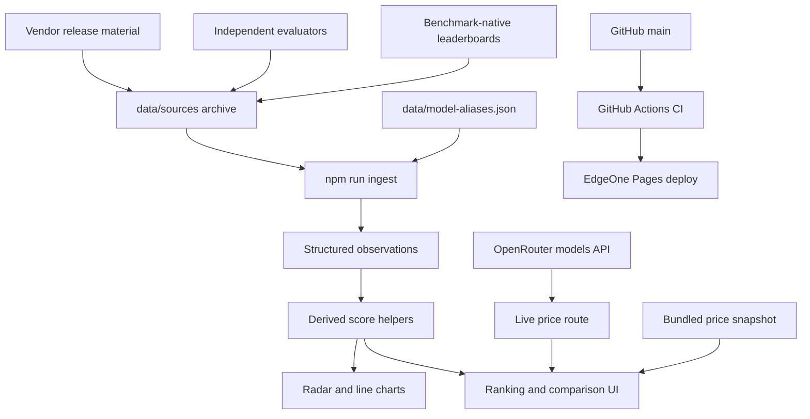
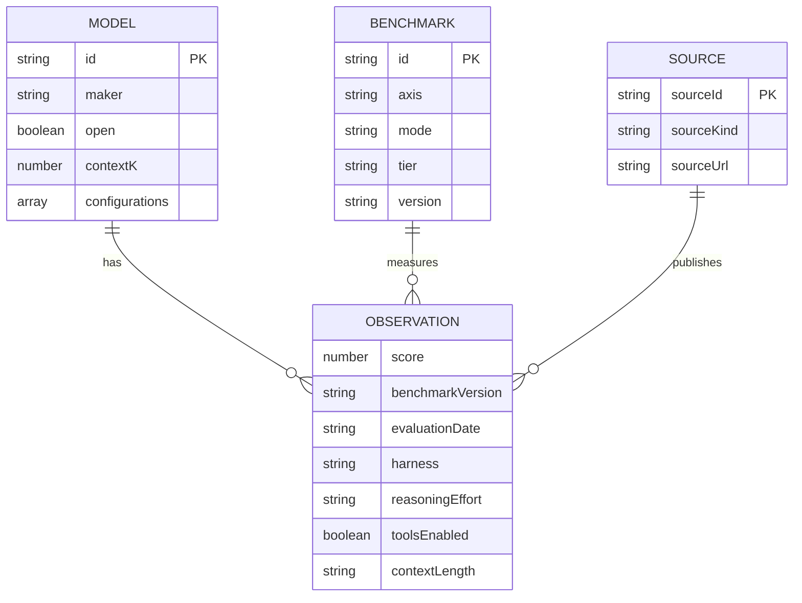
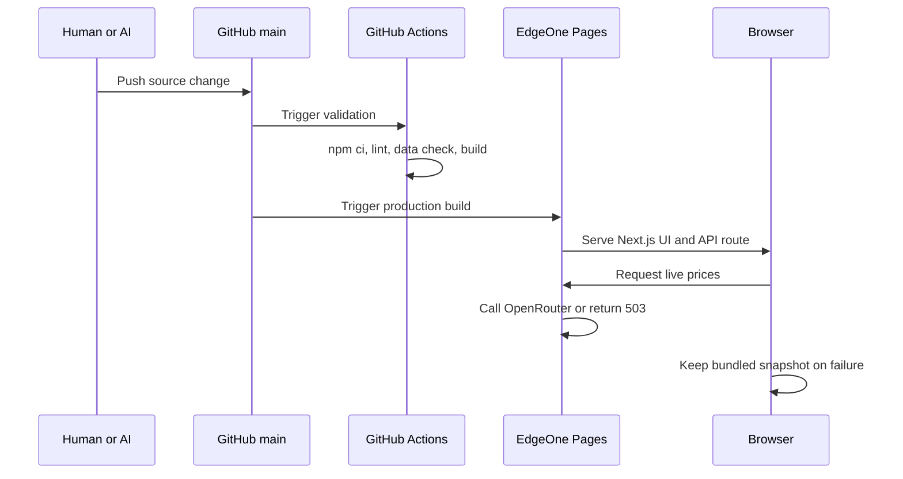

# AI Model Observatory Architecture

This document is the operational handoff for humans and coding agents. Read it before changing the data model, ranking semantics, deployment path, or UI structure.

## 1. System overview



The application has two data paths:

1. Versioned benchmark evidence, generated from the `data/sources/` archive into
   `app/observations.generated.ts` and combined with the seed rows in `app/model-data.ts`.
2. Best-effort live price refresh through `app/api/live-models/route.ts`, with bundled prices
   retained when the upstream call fails.

Current scale: **27 model families, 68 benchmarks, 999 observations across 866 of 1836 cells**,
sourced benchmark-native 695 / independent 127 / vendor 177. 98% of catalog numbers are backed
by an archive row.

## 2. Repository map

| Path | Responsibility |
| --- | --- |
| `app/model-data.ts` | Model metadata, benchmark taxonomy, observations, derived scores, source cards |
| `app/page.tsx` | Client state, rankings, coverage, radar, line charts, tables, language switching |
| `app/api/live-models/route.ts` | OpenRouter price/context lookup and short-lived cache |
| `app/globals.css` | Light visual system and responsive layout |
| `data/sources/*.jsonl` | Append-only raw transcription archive, one row per published result |
| `data/model-aliases.json` | Every editorial decision: model mapping, benchmark splits, version and source-class overrides |
| `scripts/ingest.mjs` | Archive + aliases → `app/observations.generated.ts` |
| `docs/INGEST-PROMPT.md` | The transcription contract given to a browsing model |
| `docs/UI.md` | Type scale, breakpoints, the phone contract, and how to verify a layout change |
| `scripts/check-model-data.mjs` | Observation contract enforced in CI |
| `scripts/check-model-provenance.mjs` | Audits every catalog number against the archive |
| `scripts/fetch-livebench.mjs` | Collects batch 09 from LiveBench's own data files; `--check` diffs archive vs upstream |
| `scripts/check-price-terms.mjs` | Fails when the catalog quotes a promotion recorded in a batch meta |
| `scripts/check-mobile.mjs` | Layout probe: overflow, type floor and tap-target floor under device emulation |
| `.github/workflows/ci.yml` | Lint, data contract, price terms, and production build checks |
| `.github/workflows/upstream.yml` | Weekly re-fetch of archived sources to catch upstream edits |
| `README.md` | User-facing overview and deployment instructions |
| `AGENTS.md` | Short coding-agent operating contract |

## 3. Core entities



An observation is the atomic unit. Its conceptual key is:

```text
model × benchmark × benchmark_version × harness × reasoning_effort × tools_enabled × context_length
```

### Model identity

One record per model **family**. Reasoning effort is a property of a run, so it lives on the
observation row and in `ModelRecord.configurations`, never in the model id. An id like
`gpt-5.6-terra-max` cannot receive a leaderboard line that says only `GPT-5.6 Terra` without
someone guessing which effort was meant, and guessing is what this project exists to avoid.

`configurations` is ordered strongest first. The record's top-level `intelligence`, `speed`,
`price` and so on are derived from `configurations[0]` so rankings read one number per model;
the other operating points stay visible in the model dossier. Arena Elo is taken from
whichever configuration carries one, because Arena publishes no per-effort boards.

### Ingestion pipeline

```text
data/sources/*.jsonl        raw transcription, never edited to fit the catalog
  + *.meta.json             retrieval date, and whether the batch was filtered at capture
  + data/model-aliases.json every editorial call, reviewable on its own
        │  npm run ingest
        ▼
app/observations.generated.ts    generated, do not hand-edit
        │
        ▼
OBSERVATION_ROWS in app/model-data.ts
```

The split matters: the archive is evidence and the alias file is judgement. A row with no
alias entry is **skipped and reported**, never guessed into place, and it stays in the
archive so it can be ingested later when the catalog gains that model. `npm run ingest`
prints every skipped row, so the cost of a missing catalog entry is always visible.

Values in the archive are never altered, but a batch may be **filtered at capture**: batches
02-04 kept the 2026-era frontier rows and dropped the long tail of pre-2026 models the
catalog will not track. Each batch's `.meta.json` records `filtered`, the rule used, and the
source URLs, so a fuller re-transcription can be dropped in later — `npm run ingest` picks
up whatever the files contain, with no code change.

`data/model-aliases.json` carries four kinds of decision, each with a written reason:

| Key | Decides |
| --- | --- |
| `aliases` | which published model string is which catalog model, at which effort |
| `benchmarkSplits` | when a published "version" is really a different problem set |
| `versionAliases` | when two sources spell the same version differently |
| `sourceKindOverrides` | when a page's source class is not what it looks like |

The last one is not cosmetic. Epoch AI's FrontierMath page is benchmark-native because
FrontierMath is Epoch's own benchmark; Epoch's GPQA page is an *independent* evaluation,
because GPQA belongs to someone else and Epoch is a third party running it.

### Observation store

`OBSERVATION_ROWS` is the canonical store: a flat list where every entry carries its own
`modelId`, `benchmarkId` and full provenance. Everything else is derived from it.

```text
OBSERVATION_ROWS            all transcribed rows, one per published configuration
  └─ OBSERVATIONS_BY_CELL   grouped by model × benchmark, sorted by source strength
       └─ BENCHMARK_OBSERVATIONS   the primary row of each cell
            └─ BENCHMARK_SCORES    the primary score of each cell
```

A single cell may hold several rows, because these are different results and must not be
merged: Terminal-Bench 2.1 reports Fable 5 at 83.8% under Claude Code and 80.4% under
Terminus 2. Both are stored; the table shows the primary and marks the rest as `+n`.

Primary selection is mechanical, not editorial:

1. Source strength — `benchmark` > `independent` > `vendor`.
2. Within the same class, a **system** benchmark keeps the highest score (best available
   scaffold, which is what a system lens means) and a **model** benchmark keeps the most
   recent evaluation.

Do not create an independent score table or add a number without provenance.

## 4. Source policy

Use the strongest available source for each observation:

1. **Benchmark-native leaderboard** — preferred because its version and harness are controlled by the benchmark owner.
2. **Independent evaluator** — useful for cross-model consistency and professional-work evaluations.
3. **Vendor release material** — valid for filling gaps, but preserve its exact model configuration and harness notes.

The Kimi K3 release table is a useful comparison seed, not the benchmark standard. The same rule applies to every vendor table.

Do not merge values when any of these differ materially:

- DeepSWE v1.0 vs v1.1
- Terminal-Bench 2.0 vs 2.1 (now separate benchmark ids)
- HLE without tools vs with tools
- MRCR 128K average vs 1M pointwise
- Codex vs Claude Code vs Kimi Code vs Terminus vs mini-SWE-agent
- low/high/max reasoning effort

## 5. Capability and ranking semantics

Seven radar axes are defined in `AXES`. An axis is calculated only from available compatible core observations. Missing axes remain absent; they are not zero-filled.

Coverage means evidence completeness, not model quality:

| State | Meaning |
| --- | --- |
| `Not ingested` | No compatible core observation is loaded |
| `Partial` | Some compatible core observations are loaded |
| `Broad` | At least half of compatible core observations are loaded |

Ranking lenses stay separate:

- General capability: independent composite snapshot stored on the model record.
- Coding system: core system-level coding observations, subject to the coverage floor below.
- Agent system: core system-level agent observations, subject to the coverage floor below.
- Human preference: Arena Elo.
- Speed: output tokens per second.
- Value: current capability/cost heuristic.

These lenses answer different questions and must not be silently blended.

### The portfolio coverage floor

A portfolio average compares models only when they were measured on comparable baskets. Averaging
whatever cells happen to exist does not: it rewards thin evidence, because a model measured only
on the generous benchmarks of an axis outscores one measured on all of them.

This was not hypothetical. On the agent lens, `Muse Spark 1.1` ranked first at 81.9 from 2 of 5
agent benchmarks — `mcp-atlas` and `toolathlon`, where every model scores in the 70s and 80s —
while `Claude Fable 5`, measured on all five including `osworld2` where scores collapse, sat
fifth at 75.7. `Inkling Small` ranked second on a single cell.

So `portfolioScore` publishes a number only when the model covers **at least half of that axis's
core benchmarks and at least two of them** (`PORTFOLIO_MIN_RATIO`, `PORTFOLIO_MIN_CELLS` in
`app/page.tsx`). Below the floor the value is `N/A` and the model leaves that ranking, the same
way a model with no published cost per task is absent from the value lens rather than free. Each
ranking cell and dossier KPI prints its `present/total` count, so the floor is visible rather than
inferred.

The floor applies to the ranking table and the dossier KPIs. The radar still plots every axis it
has evidence for, because it reports one axis at a time next to an explicit coverage figure
rather than collapsing a basket into a rank.

Consequence to keep in mind: with 5 core agent benchmarks the floor needs 3, and the long-context
axis has 2 core benchmarks that no model currently carries together. Adding a benchmark to an axis
raises the bar for every model on it.

## 6. Runtime and deployment



Canonical production settings:

```text
Node.js: 22
Install: npm ci
Build: npm run build
Output: .next
Host: Tencent EdgeOne Pages
Source branch: GitHub main
```

GitHub Pages is intentionally not used because it is static-only and cannot run the current Next.js API route.

EdgeOne builds from `main` independently of GitHub Actions. A failing CI run does not block a
deploy — only a failing `npm run build` does. `check:prices` and `check:upstream` are therefore
notifications rather than gates: they turn CI red while the site keeps serving whatever was last
merged. Read the CI result before merging, not after.

## 7. Change playbooks

### Add a model

1. Collect its operating parameters into a `data/sources/batch-NN-*.jsonl` with a
   `.meta.json` whose `schema` starts with `Model operating parameters`. That prefix is what
   keeps the batch out of the observation store and inside the provenance audit.
2. Add the published model strings to `data/model-aliases.json`. One family id, `effort: "*"`.
3. Add one `ModelRecord` to `MODELS` with a family-level id — never an effort in the id — and
   one `cfg(...)` per published operating point, strongest first.
4. Add provider lookup aliases to `app/api/live-models/route.ts` when live pricing exists.
5. `npm run ingest` — archived observations for that model attach themselves.
6. `npm run check:models` must pass; anything it calls unsourced needs a source or stays null.
7. Let unavailable data remain absent. A model with no published cost per task drops out of
   the value lens; it is not free.

### Add a benchmark

1. Add one `BenchmarkRecord` with axis, mode, tier, method, version and canonical URL.
2. Decide `core` / `observe` / `legacy` **before** adding scores. Only `core` feeds the radar,
   so a new evaluation of unproven comparability belongs in `observe`.
3. Add the rows to the archive; never hand-write them into `app/model-data.ts`.
4. If an evaluator uses its own name for a benchmark already in the catalog, map it with
   `benchmarkAliases` rather than creating a duplicate column.
5. If a published "version" is really a different problem set, split it with
   `benchmarkSplits` — FrontierMath Tiers 1-3 and Tier 4 are the worked example.
6. Confirm line-chart normalisation; Elo uses a separate path.

### Update an existing result

1. Never overwrite a value merely because a newer table has a different number.
2. Check whether version, harness, reasoning effort, tools, context length, model snapshot, or aggregation changed.
3. If the result is not comparable, model it as a distinct benchmark/version or update the schema before ingestion.
4. Record the new evaluation date and source URL.

## 8. CI contract

Every push and pull request must pass:

```bash
npm run lint
npm run ingest && git diff --exit-code app/observations.generated.ts
npm run check:data
npm run check:models
npm run check:prices
npm run build
```

`npm run check:upstream` is deliberately **not** in that list. It re-fetches an archived source
over the network and fails for reasons unrelated to the commit under review, which is how a red
check gets trained into background noise. It runs weekly instead, in `.github/workflows/upstream.yml`.

The data check currently enforces:

- unique model and benchmark IDs;
- no observations for unknown entities;
- finite numeric scores;
- source and version provenance;
- every derived score maps to an observation;
- an evaluation date **or** a retrieved date on every row, both ISO, never interchanged;
- `app/observations.generated.ts` matches a fresh `npm run ingest` (CI re-runs and diffs it);
- no catalog number contradicts the archive (`npm run check:models`);
- a benchmark-native system result names its harness;
- no duplicate row for one identical configuration;
- **no cell mixes two benchmark versions** — one cell is one table column, so two versions
  in it would compare one model's version against another's;
- minimum catalog/model size;
- retention of a known official Gemini 3.5 Flash observation as a regression guard;
- no catalog price is a promotion recorded in a batch's `priceTerms` (`npm run check:prices`);
  the archive keeps the promotional row, but it can no longer back a price check, the same way
  an Arena price never could.


## 9. Collection state

Ten archive batches, all under `data/sources/`. Read this before re-running a source: several
pages are known-dead or known-empty and were already worked around.

| Batch | Covers | Outcome |
| --- | --- | --- |
| 01 | Reasoning and maths | ARC Prize, Epoch FrontierMath + GPQA. Complete transcript. |
| 02 | Coding and software engineering | Terminal-Bench 2.0/2.1, SWE-bench, SWE-Bench Pro, DeepSWE, SWE-Marathon, FrontierSWE, PostTrainBench, ProgramBench. Complete, 313 rows. |
| 03 | Agents and tool use | MCP-Atlas, Toolathlon, OSWorld 2.0, Agents' Last Exam. Filtered at capture. |
| 04 | Multimodal, long context, professional | GDPval-AA, APEX, MMMU. Lowest yield of the set. |
| 05 | Independent evaluators | Vals AI sub-benchmarks, LMArena. Complete, 538 rows. |
| 06 | Model operating parameters | AA model pages, vendor pricing, LMArena Elo. |
| 07 | AA leaderboard main table | Cost per task, which batch 06 could not reach. |
| 08 | Operating parameters, second pass | AA model pages plus Anthropic, Google, DeepSeek, Alibaba, Z.AI and Thinking Machines pricing. Took catalog provenance from 67% to 97% and corrected 43 values. |
| 09 | LiveBench | 23 task columns × 36 models = 828 rows, fetched by script, not transcribed. Took cell coverage from 25.7% to 47.2%. |
| 10 | Standard vendor pricing | Claude Sonnet 5's list $3/$15. No new retrieval — promoted from batch 08's capture, where it sat in a row's note. |

Batch 09 is the first batch collected by a script rather than a browsing model. LiveBench renders
client-side and batch 05 recorded it as UNAVAILABLE for that reason, but the page loads
`table_<release>.csv`, `categories_<release>.json` and `cost_<release>.csv` from its own asset
directory — those files *are* the published numbers, so `npm run fetch:livebench` copies them
directly. This is strictly more faithful than reading a rendered table: no row limit, no
transcription error, and re-running it is the drift check (`npm run check:upstream`).

Three LiveBench decisions worth not re-litigating:

- **`source_kind` is `benchmark`, not `independent`.** Batch 05's prompt filed livebench.ai under
  independent evaluators, but that instruction never produced a row, and LiveBench publishes its
  own tasks — it is benchmark-native, which is also what `SOURCE_REGISTRY` already said.
- **Only task columns are archived.** LiveBench's category averages and Global Average are
  computed in the browser from those same columns. Archiving them would create a score with no
  published source *and* double-count its own components, which is what dropped `vals-index`.
- **The Agentic Coding tasks name `mini-SWE-agent` as their harness.** The leaderboard prints no
  scaffold, so the harness is taken from the runner LiveBench vendors at
  `livebench/agentic_code_runner/minisweagent`. Without it a benchmark-native system result would
  fail the harness rule, and the honest fix was to find the scaffold, not to relabel the rows.

Known-dead or known-empty, with the workaround already applied:

- `os-world.github.io` and `osworld-v1.xlang.ai` — stuck on "Loading verified benchmark data".
  OSWorld 2.0 was taken from `osworld-v2.xlang.ai` instead; 1.0 and Verified have no rows.
- `lastexam.ai` with-tools board — stuck on "Loading HLE results". `hle-tools` therefore has
  no benchmark-native rows, and the no-tools figures were deliberately **not** substituted.
- `github.com/SWE-EVO/SWE-EVO` — publishes no numeric leaderboard at all.
- `github.com/GAIR-NLP/IMOAnswerBench` — 404. Scores came from the IMO-Bench paper instead.
- `github.com/facebookresearch/programbench` — no table; `programbench.com` has it.
- `huggingface.co/datasets/openai/mrcr` — dataset card publishes no scores.
- MMLU-Pro HF Space and OpenRouter's model table — never rendered.

**Stanford HELM was measured and declined on 2026-08-01.** It is reachable and fully
machine-readable — every project publishes JSON under
`storage.googleapis.com/crfm-helm-public/<project>/benchmark_output/releases/<version>/` — so the
obstacle is not access. Across all 18 projects and roughly 700 model deployments, exactly one
model overlaps this catalog: `deepseek-v4-pro-thinking-disabled`, in `arabic-enterprise`. HELM's
frontier project, `capabilities` v1.15.0, tops out at GPT-5.1, Gemini 3 Pro Preview and Grok 4 —
about a generation behind. Connecting it would add a source card and no cells, which is the exact
move AGENTS.md warns about. Re-measure before reconsidering; the sweep is a short script against
the `runs.json` of each project's latest release.

Deliberately not carried, with reasons in `droppedBenchmarks`: LMArena text Elo as a benchmark
(383 rows — it is a preference lens and already lives on the model record), the Artificial
Analysis and Vals composite indices (they double-count their own components), and a few
Vals benchmarks with one to three rows.

Rows whose source publishes **no benchmark version** are archived but not ingested. This
currently costs SWE-Marathon, PostTrainBench and ProgramBench. It is deliberate: ProgramBench's
official Resolved score for GPT-5.5 is 0.5% while the Kimi vendor table reports 70.8 for the
same cell, so those columns would silently mix two different metrics.

## 10. Known limitations and next work

The highest-value next move is **scripting one more source fetcher**, because it pays twice:
a scripted batch has no row limit and no transcription error, and re-running it *is* that
source's drift check. Batch 09 turned LiveBench from "cannot be transcribed" into 828 rows and
a weekly integrity check with one script. Before writing another transcription prompt, look for
the data file the page itself loads — that is the question batch 05 did not ask about LiveBench.

- **The coverage floor names its own collection targets.** Since a portfolio score needs half an
  axis (§5), a model sitting one cell short is one observation away from entering a ranking, and
  the axes are small enough that single benchmarks unlock many models at once. As of 2026-08-01
  the two highest-leverage gaps are `mrcr`, missing for 7 models on a 2-benchmark long-context
  axis that currently ranks nobody, and `hle-no-tools`, missing for 8 on reasoning. Recompute
  before acting rather than trusting these counts — for each axis take
  `max(2, ceil(core/2))` and list the models exactly one cell below it. Worth folding into
  `check:data` as a standing report, which would make the floor self-servicing.
- Upstream diffing now exists, but only for sources with a machine-readable feed. LiveBench is
  re-fetched and compared cell by cell (`npm run check:upstream`, weekly in CI). The eight
  transcribed batches are still undiffable — nothing tells you that Terminal-Bench or Vals
  edited a number after it was archived. Each source that gains a fetcher gains a drift check.
- Five catalog numbers still have no archive row: cost per task for Claude Opus 4.8 and
  GPT-5.5 (both absent from the AA leaderboard), Opus 4.8's code Elo, and Inkling's speed and
  latency. `npm run check:models` lists them. Grok 4.3's two Elo figures left this list without
  new collection: batch 09 added a lowercase `grok-4.3` alias, which attached LMArena rows that
  had been sitting in the archive unmatched. Check for an orphaned row before collecting again.
- **The catalog quotes list price, never a promotion.** A temporary discount is not comparable
  against every other model's list price, and it goes stale silently the day it lapses — so
  Claude Sonnet 5 is carried at its standard $3/$15 rather than the $2/$10 introductory rate
  that runs to 2026-08-31. The promotion stays archived because it is a real published fact, but
  a promotional row can no longer back a price check (`check-model-provenance.mjs` excludes it,
  the same way it excludes an Arena price), and `npm run check:prices` fails if one ever reaches
  a catalog record. Only the Sonnet 5 promotion is recorded as a `priceTerms` entry so far; the
  other tier notes in batch metas are still prose.
- Vendors also price in tiers and regions and the catalog quotes one. Google publishes Standard,
  Batch, Flex and Priority; Alibaba publishes six regions. The tier archived is recorded in each
  batch's meta.
- 704 archived rows are not ingested because the catalog has no model for them, almost all
  previous-generation. They are kept deliberately: adding the model is all it takes for
  `npm run ingest` to attach them, with no code change.
- Four benchmarks are still empty: `swe-evo` (no leaderboard exists), `videommmu` (newest
  entry is Claude 3.5 Sonnet), `mmlu-pro` (Vals has rows but labels the version by year, which
  cannot be matched to the catalog's) and `frontiermath-t4` beyond the models already covered.
- Cell coverage, not source count, is the metric that matters. `npm run check:data` prints
  filled cells and the benchmark/independent/vendor split on every run; adding a source card
  without adding rows moves neither number.
- Model identity was the ingestion bottleneck and is now resolved: the catalog holds one
  record per family and effort lives on the observation row. Ingestion rose from 179 to 214
  rows on the same archive when this changed, because leaderboards publish one line per
  model, not one per effort.
- Live price matching is substring-based and should eventually use canonical provider model IDs.
- Pixel regression testing is not yet in CI. Add Playwright screenshots only after a stable public
  preview URL and baseline approval exist. `npm run check:mobile` covers the part that regresses
  silently — overflow, type floor, tap-target floor — but it needs Chrome and a running server, so
  it is a local gate rather than a CI one.
- General capability values are imported composite snapshots, not recomputed from the benchmark portfolio.

## 11. Interface

`docs/UI.md` is the contract for everything between the data and the screen: the two type scales,
the four breakpoints, the six guarantees the phone layout makes, and how to verify a layout change
without trusting a screenshot taken the wrong way.

The short version. The desktop layout is a 72px rail plus a workspace of six sections. Below
800px the rail becomes a labelled bottom bar, the header goes static, section heads stack so their
control gets the full width, and ranking rows become cards carrying a three-metric strip. Nothing
renders below 9px, no control is under 36px, wide content lives in a named scroller with
`overscroll-behavior-x: contain`, and every fixed element pads itself with a safe-area inset.

Two traps are worth repeating here because both fail silently: `overflow:hidden` on a panel turns
it into a scroll container and kills `position:sticky` inside it (use `overflow:clip`), and
headless Chrome without device emulation ignores the viewport meta tag and invents overflow that
no phone shows.
