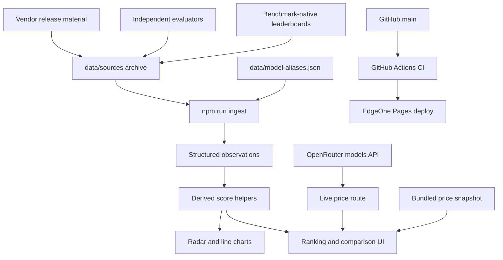
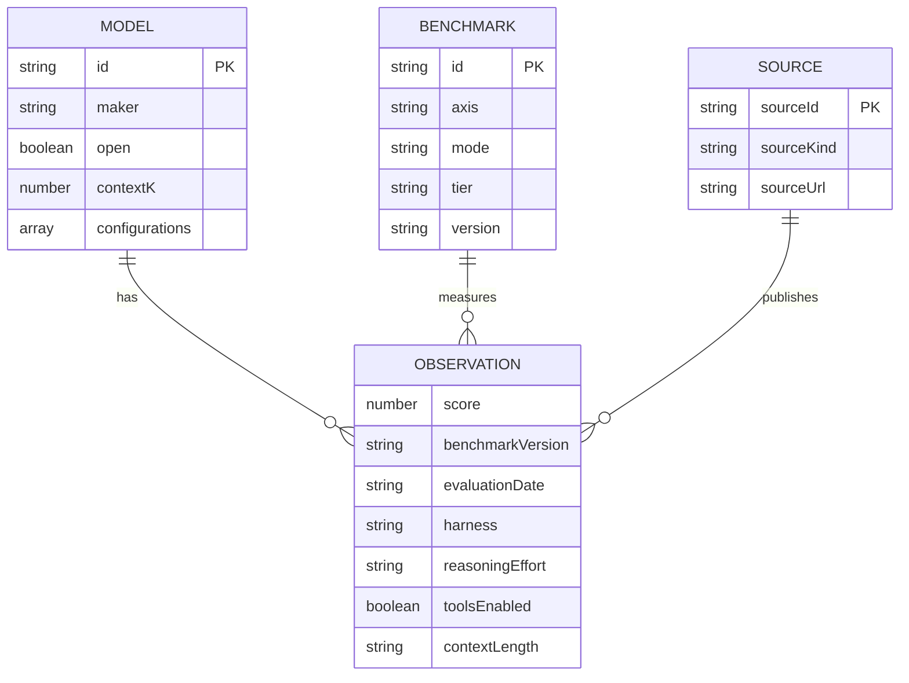
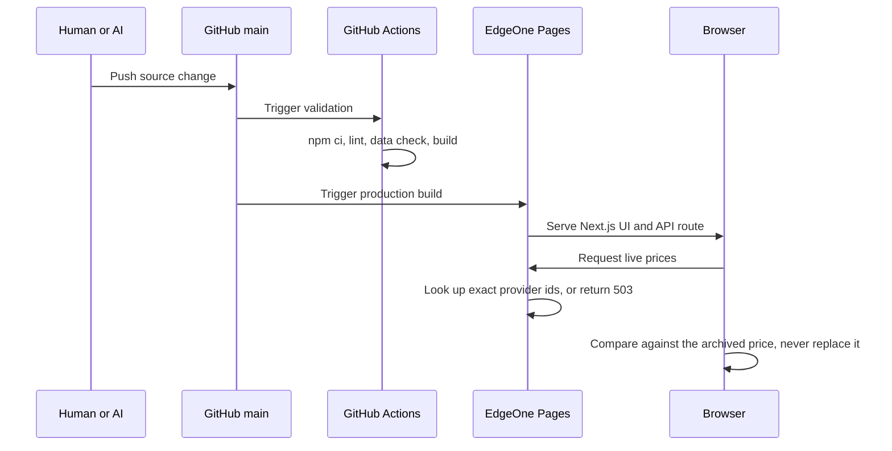

# AI Model Observatory Architecture

This document is the operational handoff for humans and coding agents. Read it before changing the data model, ranking semantics, deployment path, or UI structure.

## 1. System overview



The application has two data paths:

1. Versioned benchmark evidence, generated from the `data/sources/` archive into
   `app/observations.generated.ts` and combined with the seed rows in `app/model-data.ts`.
2. A live price **comparison** through `app/api/live-models/route.ts`. It does not write into
   the catalog. The card shows the archived list price, and the provider's current figure
   appears beside it only where the two disagree — a disagreement is a collection signal, not
   a number to display. See §6.

Current scale: **28 model families, 68 benchmarks, 1224 observations across 919 of 1904 cells**,
sourced benchmark-native 753 / independent 294 / vendor 177. **310 of 313 catalog numbers are
backed by an archive row**; the three that are not are listed by `npm run check:models` on every
run rather than hidden.

## 2. Repository map

| Path | Responsibility |
| --- | --- |
| `app/model-data.ts` | Model metadata, benchmark taxonomy, observations, derived scores, source cards |
| `app/models/page.tsx` | The observatory itself: client state, rankings, coverage, radar, line charts, tables, language switching |
| `app/models/layout.tsx` | Its title — the page is a client component and cannot export metadata |
| `app/page.tsx` + `app/home-content.ts` + `app/home.module.css` | The owner's personal site at `/`. Reads no data file; see AGENTS.md "Two sites share this repo" |
| `app/api/live-models/route.ts` | OpenRouter price/context lookup and short-lived cache |
| `app/globals.css` | Light visual system and responsive layout |
| `data/sources/*.jsonl` | Append-only raw transcription archive, one row per published result |
| `data/model-aliases.json` | Every editorial decision: model mapping, benchmark splits, version and source-class overrides |
| `scripts/ingest.mjs` | Archive + aliases → `app/observations.generated.ts` |
| `scripts/lib/archive.mjs` | Alias resolution and archive reading, shared by ingestion and the gap report |
| `scripts/report-gaps.mjs` | What has *not* been collected: cells below a floor, unaliased rows, new upstream models |
| `scripts/publish-gaps-issue.sh` | Publishes that report to one self-updating GitHub issue |
| `docs/INGEST-PROMPT.md` | The transcription contract given to a browsing model |
| `docs/UI.md` | Type scale, breakpoints, the phone contract, and how to verify a layout change |
| `scripts/check-model-data.mjs` | Observation contract enforced in CI |
| `scripts/check-model-provenance.mjs` | Audits every catalog number against the archive |
| `scripts/fetchers/*.mjs` | One module per source this project can re-read by script |
| `scripts/fetch-source.mjs` | Runs them: writes a batch, or `--check` diffs every archive against upstream |
| `scripts/open-refresh-pr.sh` | Turns a moved live board into one self-updating pull request |
| `scripts/check-price-terms.mjs` | Fails when the catalog quotes a promotion recorded in a batch meta |
| `scripts/check-mobile.mjs` | Layout probe: overflow, type floor and tap-target floor under device emulation |
| `.github/workflows/ci.yml` | Lint, data contract, price terms, and production build checks |
| `.github/workflows/upstream.yml` | Daily: re-fetch archived sources for drift, then report what was never collected |
| `README.md` | User-facing overview and deployment instructions |
| `AGENTS.md` | Short coding-agent operating contract |

## 3. Core entities



An observation is the atomic unit. Its conceptual key is:

```text
model × benchmark × benchmark_version × harness × reasoning_effort × tools_enabled × context_length
```

### Model identity

One record per model **family**. Reasoning effort is a property of a run, so it lives on the
observation row and in `ModelRecord.configurations`, never in the model id. An id like
`gpt-5.6-terra-max` cannot receive a leaderboard line that says only `GPT-5.6 Terra` without
someone guessing which effort was meant, and guessing is what this project exists to avoid.

`configurations` is ordered strongest first. The record's top-level `intelligence`, `speed`,
`price` and so on are derived from `configurations[0]` so rankings read one number per model;
the other operating points stay visible in the model dossier. Arena Elo is taken from
whichever configuration carries one, because Arena publishes no per-effort boards.

### Ingestion pipeline

```text
data/sources/*.jsonl        raw transcription, never edited to fit the catalog
  + *.meta.json             retrieval date, and whether the batch was filtered at capture
  + data/model-aliases.json every editorial call, reviewable on its own
        │  npm run ingest
        ▼
app/observations.generated.ts    generated, do not hand-edit
        │
        ▼
OBSERVATION_ROWS in app/model-data.ts
```

The split matters: the archive is evidence and the alias file is judgement. A row with no
alias entry is **skipped and reported**, never guessed into place, and it stays in the
archive so it can be ingested later when the catalog gains that model. `npm run ingest`
prints every skipped row, so the cost of a missing catalog entry is always visible.

Resolution is `(model_raw, effort)` and, since 2026-08-05, optionally the batch file: an alias may
carry `"file"` and a file-scoped entry beats a global one. It exists because a published string is
not always one model. DeepSeek shipped V4 Flash as a preview and then as the post-trained 0731
release; LiveBench, Epoch and LMArena publish both under `deepseek-v4-flash` and
`deepseek-v4-flash-0731`, while Artificial Analysis kept the bare slug for the *official* model.
One global mapping cannot express that, and the one that existed put the preview's LiveBench
scores in the 0731 record — half the real numbers, on 23 cells, with every check green. Effort
cannot stand in for the scope: on LiveBench neither release carries one. Scope is a last resort;
a string nobody can attribute stays unmapped, which is what rule 8 asks for.

Values in the archive are never altered, but a batch may be **filtered at capture**: batches
02-04 kept the 2026-era frontier rows and dropped the long tail of pre-2026 models the
catalog will not track. Each batch's `.meta.json` records `filtered`, the rule used, and the
source URLs, so a fuller re-transcription can be dropped in later — `npm run ingest` picks
up whatever the files contain, with no code change.

`data/model-aliases.json` carries every kind of judgement the archive itself must not encode,
each with a written reason:

| Key | Decides |
| --- | --- |
| `aliases` | which published model string is which catalog model, at which effort — and, where a string means different models in different sources, in which batch file |
| `benchmarkSplits` | when a published "version" is really a different problem set |
| `versionAliases` | when two sources spell the same version differently |
| `benchmarkAliases` | when an evaluator uses its own name for a benchmark already catalogued |
| `versionFallbacks` | when a source publishes no version label and the catalog owns the column |
| `droppedBenchmarks` | what is deliberately not carried, and why |
| `sourceKindOverrides` | when a page's source class is not what it looks like |
| `supersededRows` | when a later reading replaces an earlier one — a whole batch, one benchmark, or a single field of a single row |

`sourceKindOverrides` is not cosmetic. Epoch AI's FrontierMath page is benchmark-native because
FrontierMath is Epoch's own benchmark; Epoch's GPQA page is an *independent* evaluation,
because GPQA belongs to someone else and Epoch is a third party running it.

`supersededRows` exists because the archive is append-only and a scripted fetch is not a
correction of the transcription it replaces — it is the same measurement, read exactly instead
of by eye. Batch 02 read 18 DeepSWE rows off the screen rounded to whole points; batch 11 reads
all 50 configurations from the artifact the page loads. Ingesting both would put two rows in one
cell and let the rounded reading win the primary slot, because a system benchmark keeps the
highest score within a source class and 74 beats 73.6. So the transcribed rows stay in the
archive as evidence of what the page showed that day, and the alias file records that they are
no longer ingested. `npm run ingest` prints them, like every other skip.

An entry can be scoped four ways, narrowing from a whole batch down to one number:
`file` alone supersedes everything in a batch; `benchmark` and `benchmarkVersion` narrow it to a
column (batch 02 holds Terminal-Bench 2.0 and 2.1 under one name and only 2.1 was rescripted);
`modelRaw` and `field` narrow it to a single value in a single row. The last pair exists because
of Inkling: the Tinker pricing page publishes 256K, which is that product's serving limit, while
the model's own `config.json` publishes 1,048,576. Both are true, both are archived, and neither
should be deleted — the entry only tells the provenance audit which one answers "what is this
model's context window".

### Observation store

`OBSERVATION_ROWS` is the canonical store: a flat list where every entry carries its own
`modelId`, `benchmarkId` and full provenance. Everything else is derived from it.

```text
OBSERVATION_ROWS            all transcribed rows, one per published configuration
  └─ OBSERVATIONS_BY_CELL   grouped by model × benchmark, sorted by source strength
       └─ BENCHMARK_OBSERVATIONS   the primary row of each cell
            └─ BENCHMARK_SCORES    the primary score of each cell
```

A single cell may hold several rows, because these are different results and must not be
merged: Terminal-Bench 2.1 reports Fable 5 at 83.8% under Claude Code and 80.4% under
Terminus 2. Both are stored; the table shows the primary and marks the rest as `+n`.

Primary selection is mechanical, not editorial:

1. Source strength — `benchmark` > `independent` > `vendor`.
2. Within the same class, a **system** benchmark keeps the highest score (best available
   scaffold, which is what a system lens means) and a **model** benchmark keeps the most
   recent evaluation.

Do not create an independent score table or add a number without provenance.

## 4. Source policy

Use the strongest available source for each observation:

1. **Benchmark-native leaderboard** — preferred because its version and harness are controlled by the benchmark owner.
2. **Independent evaluator** — useful for cross-model consistency and professional-work evaluations.
3. **Vendor release material** — valid for filling gaps, but preserve its exact model configuration and harness notes.

The Kimi K3 release table is a useful comparison seed, not the benchmark standard. The same rule applies to every vendor table.

Do not merge values when any of these differ materially:

- DeepSWE v1.0 vs v1.1
- Terminal-Bench 2.0 vs 2.1 (now separate benchmark ids)
- HLE without tools vs with tools
- MRCR 128K average vs 1M pointwise
- Codex vs Claude Code vs Kimi Code vs Terminus vs mini-SWE-agent
- low/high/max reasoning effort

## 5. Capability and ranking semantics

Seven radar axes are defined in `AXES`. An axis is calculated only from available compatible core observations. Missing axes remain absent; they are not zero-filled.

Coverage means evidence completeness, not model quality:

| State | Meaning |
| --- | --- |
| `Not ingested` | No compatible core observation is loaded |
| `Partial` | Some compatible core observations are loaded |
| `Broad` | At least half of compatible core observations are loaded |

Ranking lenses stay separate:

- General capability: independent composite snapshot stored on the model record.
- Coding system: core system-level coding observations, subject to the coverage floor below.
- Agent system: core system-level agent observations, subject to the coverage floor below.
- Human preference: Arena Elo.
- Speed: output tokens per second.
- Value: current capability/cost heuristic.

These lenses answer different questions and must not be silently blended.

### The portfolio coverage floor

A portfolio average compares models only when they were measured on comparable baskets. Averaging
whatever cells happen to exist does not: it rewards thin evidence, because a model measured only
on the generous benchmarks of an axis outscores one measured on all of them.

This was not hypothetical. On the agent lens, `Muse Spark 1.1` ranked first at 81.9 from 2 of 5
agent benchmarks — `mcp-atlas` and `toolathlon`, where every model scores in the 70s and 80s —
while `Claude Fable 5`, measured on all five including `osworld2` where scores collapse, sat
fifth at 75.7. `Inkling Small` ranked second on a single cell.

So `portfolioScore` publishes a number only when the model covers **at least half of that axis's
core benchmarks and at least two of them** (`PORTFOLIO_MIN_RATIO`, `PORTFOLIO_MIN_CELLS`,
`portfolioFloor` in `app/model-data.ts` — the data layer, not the page, because
`npm run report:gaps` reads the same rule to find the models sitting one cell below it).
Below the floor the value is `N/A` and the model leaves that ranking, the same
way a model with no published cost per task is absent from the value lens rather than free. Each
ranking cell and dossier KPI prints its `present/total` count, so the floor is visible rather than
inferred.

The floor applies to the ranking table and the dossier KPIs. The radar still plots every axis it
has evidence for, because it reports one axis at a time next to an explicit coverage figure
rather than collapsing a basket into a rank.

Consequence to keep in mind: with 5 core agent benchmarks the floor needs 3, and the long-context
axis has 2 core benchmarks that no model currently carries together. Adding a benchmark to an axis
raises the bar for every model on it.

## 6. Runtime and deployment



### The live price path is a comparison, not a refresh

Two rules of this project make an overwriting price feed impossible to keep honest. The catalog
quotes **list price, never a promotion** (§10), and every catalog number is **backed by an archive
row** (`npm run check:models`) — a figure that arrives at runtime satisfies neither. The feed used
to write straight into the model record anyway, which meant the dashboard silently published the
Claude Sonnet 5 introductory rate that §10 exists to exclude, and `check:prices` could not see it
because that check runs at build time over batch metadata.

So the archived price is what the card shows. OpenRouter's current figure sits beside it and is
rendered only where the two disagree by more than 0.5%. Today 17 of 27 corroborate the archive
exactly, which is a provenance signal worth having; the other 10 are a collection queue.

Lookups are **exact provider ids**, never substrings. `list.find` returns the first id containing
the needle, and OpenRouter serves overlapping names: the needle `gpt-5.6` matched
`openai/gpt-5.6-luna-pro`, so the GPT-5.6 Sol card rendered $0.10/$0.60 in place of $5/$30. Six
other lookups landed on a `-fast`, `-pro` or `-lite` variant the same way, and none of it was
visible, because a wrong price looks exactly like a right one. A retired id now resolves to
nothing and the card keeps its archived figure, which is the safe direction to fail in;
`npm run report:gaps` reports the dead lookup.

Canonical production settings:

```text
Node.js: 22
Install: npm ci
Build: npm run build
Output: .next
Host: Tencent EdgeOne Pages
Source branch: GitHub main
```

GitHub Pages is intentionally not used because it is static-only and cannot run the current Next.js API route.

EdgeOne builds from `main` independently of GitHub Actions. A failing CI run does not block a
deploy — only a failing `npm run build` does. `check:prices` and `check:upstream` are therefore
notifications rather than gates: they turn CI red while the site keeps serving whatever was last
merged. Read the CI result before merging, not after.

## 7. Change playbooks

### Add a model

1. Collect its operating parameters into a `data/sources/batch-NN-*.jsonl` with a
   `.meta.json` whose `schema` starts with `Model operating parameters`. That prefix is what
   keeps the batch out of the observation store and inside the provenance audit.
2. Add the published model strings to `data/model-aliases.json`. One family id, `effort: "*"`.
3. Add one `ModelRecord` to `MODELS` with a family-level id — never an effort in the id — and
   one `cfg(...)` per published operating point, strongest first.
4. Add provider lookup aliases to `app/api/live-models/route.ts` when live pricing exists.
5. `npm run ingest` — archived observations for that model attach themselves.
6. `npm run check:models` must pass; anything it calls unsourced needs a source or stays null.
7. Let unavailable data remain absent. A model with no published cost per task drops out of
   the value lens; it is not free.

### Add a benchmark

1. Add one `BenchmarkRecord` with axis, mode, tier, method, version and canonical URL.
2. Decide `core` / `observe` / `legacy` **before** adding scores. Only `core` feeds the radar,
   so a new evaluation of unproven comparability belongs in `observe`.
3. Add the rows to the archive; never hand-write them into `app/model-data.ts`.
4. If an evaluator uses its own name for a benchmark already in the catalog, map it with
   `benchmarkAliases` rather than creating a duplicate column.
5. If a published "version" is really a different problem set, split it with
   `benchmarkSplits` — FrontierMath Tiers 1-3 and Tier 4 are the worked example.
6. Confirm line-chart normalisation; Elo uses a separate path.

### Update an existing result

1. Never overwrite a value merely because a newer table has a different number.
2. Check whether version, harness, reasoning effort, tools, context length, model snapshot, or aggregation changed.
3. If the result is not comparable, model it as a distinct benchmark/version or update the schema before ingestion.
4. Record the new evaluation date and source URL.

## 8. CI contract

Every push and pull request must pass:

```bash
npm run lint
npm run ingest && git diff --exit-code app/observations.generated.ts
npm run check:data
npm run check:models
npm run check:prices
npm run build
```

`npm run check:upstream` is deliberately **not** in that list. It re-fetches an archived source
over the network and fails for reasons unrelated to the commit under review, which is how a red
check gets trained into background noise. It runs daily instead, in `.github/workflows/upstream.yml`.

`npm run report:gaps` is not in that list either, for a different reason: **it can never fail.**
An uncollected model is not a defect in the commit under review, so the report exits zero no
matter what it finds and the finding becomes an issue instead. The daily job publishes it to one
long-lived issue titled *Collection gaps*, edited in place and closed when the report comes back
empty — so an open issue always means there is something to collect, and there is never a backlog
of stale issues to ignore. Add `--no-network` to run the two local sections offline.

The data check currently enforces:

- unique model and benchmark IDs;
- no observations for unknown entities;
- finite numeric scores;
- source and version provenance;
- every derived score maps to an observation;
- an evaluation date **or** a retrieved date on every row, both ISO, never interchanged;
- `app/observations.generated.ts` matches a fresh `npm run ingest` (CI re-runs and diffs it);
- no catalog number contradicts the archive (`npm run check:models`);
- a benchmark-native system result names its harness;
- no duplicate row for one identical configuration;
- **no cell mixes two benchmark versions** — one cell is one table column, so two versions
  in it would compare one model's version against another's;
- minimum catalog/model size;
- retention of a known official Gemini 3.5 Flash observation as a regression guard;
- every catalog number, including context window and open-weights status, agrees with the
  archive or is reported as unsourced (`npm run check:models`); context length is *reported*
  rather than failed on, because a 1,048,576-token window reaches this project as 1000, 1049 or
  1050 depending on who rounded it;
- no `model_raw` differs from an existing alias only in casing — alias resolution is
  case-sensitive, so such a row resolves to nothing and is silently dropped from ingest;
- no catalog price is a promotion recorded in a batch's `priceTerms` (`npm run check:prices`);
  the archive keeps the promotional row, but it can no longer back a price check, the same way
  an Arena price never could.


## 9. Collection state

Ten archive batches, all under `data/sources/`. Read this before re-running a source: several
pages are known-dead or known-empty and were already worked around.

| Batch | Covers | Outcome |
| --- | --- | --- |
| 01 | Reasoning and maths | ARC Prize, Epoch FrontierMath + GPQA. Complete transcript. |
| 02 | Coding and software engineering | Terminal-Bench 2.0/2.1, SWE-bench, SWE-Bench Pro, DeepSWE, SWE-Marathon, FrontierSWE, PostTrainBench, ProgramBench. Complete, 313 rows. |
| 03 | Agents and tool use | MCP-Atlas, Toolathlon, OSWorld 2.0, Agents' Last Exam. Filtered at capture. |
| 04 | Multimodal, long context, professional | GDPval-AA, APEX, MMMU. Lowest yield of the set. |
| 05 | Independent evaluators | Vals AI sub-benchmarks, LMArena. Complete, 538 rows. |
| 06 | Model operating parameters | AA model pages, vendor pricing, LMArena Elo. |
| 07 | AA leaderboard main table | Cost per task, which batch 06 could not reach. |
| 08 | Operating parameters, second pass | AA model pages plus Anthropic, Google, DeepSeek, Alibaba, Z.AI and Thinking Machines pricing. Took catalog provenance from 67% to 97% and corrected 43 values. |
| 09 | LiveBench | 23 task columns × 36 models = 828 rows, fetched by script, not transcribed. Took cell coverage from 25.7% to 47.2%. |
| 10 | Standard vendor pricing | Claude Sonnet 5's list $3/$15. No new retrieval — promoted from batch 08's capture, where it sat in a row's note. |
| 11 | DeepSWE | 50 configurations fetched from the artifact the board loads. Supersedes batch 02's 18 transcribed rows of the same page. |
| 12 | Epoch AI export | 538 rows from the CC BY ZIP: Epoch's own GPQA runs plus four second-hand boards with no first-hand path. **FrontierMath and Tier 4 are deliberately not read** — the export disagrees with Epoch's own page by about 1.7x; see the fetcher header. |
| 13 | Terminal-Bench 2.1 | 17 submissions from the Supabase function the page calls, each with its agent, effort and run date. Supersedes batch 02's 2.1 rows. |
| 14 | Artificial Analysis | 590 configurations of operating parameters from the REST API. Not observations — this batch feeds `check:models`. On demand, needs `AA_API_KEY`. |
| 15 | Model config.json | Context windows read from each model's own Hugging Face `config.json`. Two rows, added to settle whether Inkling's window is a serving limit or an architectural maximum. |
| 16 | ALE supplement | Three rows batch 03 missed despite promising every row that maps to a catalog model. Hand-read; ALE publishes nothing machine-readable. |
| 17 | Qwen3.8 release tables | Both performance tables from the 2026-08-03 release post, 465 rows: 86 benchmark labels × 8 published model columns. Captured by rendering the page, not by eye — `scripts/capture-qwen-release.mjs`. Only Qwen3.8-Max is mapped; the competitor columns are archived and refused per-file. 12 rows land in a catalog column, and they wait on a catalog record. |
| 18 | Agents' Last Exam | 57 configurations across 24 models and 11 harnesses, read from the endpoint the leaderboard page calls. Supersedes the 19 rows batches 03 and 16 hand-read on the stated grounds that ALE publishes nothing machine-readable. |
| 19 | GDPval-AA v2 | 175 configurations, rendered from the leaderboard AA publishes for free. Its API keeps this evaluation behind the Pro tier, which is why §9 listed GDPval as having no scripted path. Supersedes batch 04's 14 hand-read rows. |

### Which sources can be re-read by script

Measured twice on 2026-08-01. **Do not re-probe without reading this** — and note *how* the two
passes differed, because that is the reusable part.

The first pass fetched each landing page and searched it for referenced `.json`/`.csv` assets,
`/api/` strings and framework state. That found DeepSWE and nothing else. **It was wrong about two
sources**, and wrong in a way worth naming: a landing page cannot tell you about a data file
published somewhere other than the site. The second pass looked for exports, repositories and the
endpoints a client builds at runtime, and found the two largest additions to this archive.

| Source | Verdict |
| --- | --- |
| LiveBench | `table_<release>.csv` + `categories_*.json` + `cost_*.csv`. **Scripted, batch 09.** |
| DeepSWE | `/artifacts/v1.1/leaderboard-live.json` — every configuration with harness, effort, pass@1, CI, cost. **Scripted, batch 11.** |
| Epoch AI | `epoch.ai/data/benchmark_data.zip` — 76 CSVs, CC BY. Invisible from the page. **Scripted, batch 12** — but not every CSV is usable: the FrontierMath files disagree with Epoch's own leaderboard by about 1.7x and are excluded. An export being official does not make it the same measurement as the page. |
| Terminal-Bench | An unauthenticated Supabase Edge Function the page calls, found in Harbor's client source. **Scripted, batch 13.** |
| Artificial Analysis | A documented REST API at `/api/v2`. **Scripted, batch 14**, on demand with `AA_API_KEY`. The free tier carries intelligence index, cost per task, speed, latency and pricing; GDPval-AA and AA-LCR return 403 behind the Pro tier, so those two core benchmarks still have no scripted path. |
| GDPval-AA | The API answers 403 (Pro tier) but the leaderboard **page** is public and client-rendered. **Scripted, batch 19**, by rendering it — the first fetcher that drives a browser, and the most fragile one for that reason. Its harness and tool setting are re-read from the page text every run rather than carried over from the transcription. |
| Agents' Last Exam | `/api/demo/leaderboard` — 689 rows, 25 models, 15 harnesses, 12 splits, with pass rate, partial credit, task counts and cost. **Scripted, batch 18.** The path appears only inside the leaderboard page's client chunk; `/api/leaderboard` and `/data/leaderboard.json` are both 404, which is how two passes concluded the board publishes nothing machine-readable. |
| Humanity's Last Exam | `lastexam.ai` server-renders its table, so it *could* be scripted — but re-reading it on 2026-08-05 returned the same nine models and the same scores batch 01 transcribed, down to the decimal. The source has not published a frontier model in a generation. Scripting it would buy a drift check on a board that does not move, not new cells. |
| Qwen release posts | No data file found: `?id=` returns the SPA shell, `/api/blog?id=` returns the same, and there is no `qwenlm.github.io` mirror. But the tables are real DOM once the app runs, so they are captured by rendering the page over CDP — **scripted, batch 17**, `scripts/capture-qwen-release.mjs`, run per release rather than daily. A release post is frozen after publication, so there is nothing for a drift check to watch. |
| LM Arena | `lmarena/arena-catalog` publishes `data/leaderboard-text.json`, and it decodes — but it is **stale**: 282 models topped by `gemini-3-pro` at 1487, with no Fable 5, Opus 5, GPT-5.6 or Kimi K3. Nothing in the repo says it stopped syncing. |
| SWE-bench | `swe-bench.github.io/data/leaderboards.json`, 180 Verified entries, genuinely fetchable — and useless: the newest entry is Opus 4.5 from 2025-12, and `swe-verified` is a legacy column. The HELM situation exactly. |
| Scale, MMMU, Mercor APEX, HLE | Hugging Face's `/api/datasets/{id}/leaderboard` returns 200 for all four, which is a trap: every record is a **vendor self-report scraped from the model's own card**, `verified:false`, with no version, harness, effort or date. SWE-bench Pro's mixes 19 model-card claims with 6 official rows and nothing distinguishes them. |
| ARC Prize | The verified board publishes nothing readable. `arcprize/arc_agi_v2_public_eval` does — and it is a **different split**: GPT-5.2 xHigh scores 64.0 there against 52.9 on the verified board. Substituting it would have moved the column ~11 points. |
| Vals AI, OSWorld, FrontierSWE, ALE, MCP-Atlas | Nothing machine-readable, on either pass. Their numbers reach the catalog only by hand, or second-hand through Epoch. |

Five of sixteen batches are now scripted, and only those five have a drift check or an automatic
refresh. The rest are hand transcriptions whose only freshness signal is how long ago someone read
them — which is why the source cards print that date (§10).

Batch 09 is the first batch collected by a script rather than a browsing model. LiveBench renders
client-side and batch 05 recorded it as UNAVAILABLE for that reason, but the page loads
`table_<release>.csv`, `categories_<release>.json` and `cost_<release>.csv` from its own asset
directory — those files *are* the published numbers, so `npm run fetch:livebench` copies them
directly. This is strictly more faithful than reading a rendered table: no row limit, no
transcription error, and re-running it is the drift check (`npm run check:upstream`).

Three LiveBench decisions worth not re-litigating:

- **`source_kind` is `benchmark`, not `independent`.** Batch 05's prompt filed livebench.ai under
  independent evaluators, but that instruction never produced a row, and LiveBench publishes its
  own tasks — it is benchmark-native, which is also what `SOURCE_REGISTRY` already said.
- **Only task columns are archived.** LiveBench's category averages and Global Average are
  computed in the browser from those same columns. Archiving them would create a score with no
  published source *and* double-count its own components, which is what dropped `vals-index`.
- **The Agentic Coding tasks name `mini-SWE-agent` as their harness.** The leaderboard prints no
  scaffold, so the harness is taken from the runner LiveBench vendors at
  `livebench/agentic_code_runner/minisweagent`. Without it a benchmark-native system result would
  fail the harness rule, and the honest fix was to find the scaffold, not to relabel the rows.

Known-dead or known-empty, with the workaround already applied:

- `os-world.github.io` and `osworld-v1.xlang.ai` — stuck on "Loading verified benchmark data".
  OSWorld 2.0 was taken from `osworld-v2.xlang.ai` instead; 1.0 and Verified have no rows.
- `lastexam.ai` with-tools board — stuck on "Loading HLE results". `hle-tools` therefore has
  no benchmark-native rows, and the no-tools figures were deliberately **not** substituted.
- `github.com/SWE-EVO/SWE-EVO` — publishes no numeric leaderboard at all.
- `github.com/GAIR-NLP/IMOAnswerBench` — 404. Scores came from the IMO-Bench paper instead.
- `github.com/facebookresearch/programbench` — no table; `programbench.com` has it.
- `huggingface.co/datasets/openai/mrcr` — dataset card publishes no scores.
- MMLU-Pro HF Space and OpenRouter's model table — never rendered.

**Stanford HELM was measured and declined on 2026-08-01.** It is reachable and fully
machine-readable — every project publishes JSON under
`storage.googleapis.com/crfm-helm-public/<project>/benchmark_output/releases/<version>/` — so the
obstacle is not access. Across all 18 projects and roughly 700 model deployments, exactly one
model overlaps this catalog: `deepseek-v4-pro-thinking-disabled`, in `arabic-enterprise`. HELM's
frontier project, `capabilities` v1.15.0, tops out at GPT-5.1, Gemini 3 Pro Preview and Grok 4 —
about a generation behind. Connecting it would add a source card and no cells, which is the exact
move AGENTS.md warns about. Re-measure before reconsidering; the sweep is a short script against
the `runs.json` of each project's latest release.

Deliberately not carried, with reasons in `droppedBenchmarks`: LMArena text Elo as a benchmark
(383 rows — it is a preference lens and already lives on the model record), the Artificial
Analysis and Vals composite indices (they double-count their own components), and a few
Vals benchmarks with one to three rows.

Rows whose source publishes **no benchmark version** are archived but not ingested. This
currently costs SWE-Marathon, PostTrainBench and ProgramBench. It is deliberate: ProgramBench's
official Resolved score for GPT-5.5 is 0.5% while the Kimi vendor table reports 70.8 for the
same cell, so those columns would silently mix two different metrics.

## 10. Known limitations and next work

**The four scripted boards now maintain themselves; the other eleven batches cannot.** Closing
that gap is not a code problem — §9 records that no other source publishes a data file to read.
Re-probing is cheap but the answer is written down; go read it before spending an afternoon on it.

**It is no longer the whole of the remaining work, though, and the reason is worth stating plainly:
a scripted source is not automatically a correct one.** Epoch's FrontierMath export disagreed with
Epoch's own leaderboard by about 1.7x, and every structural check passed — the rows were
well-formed, versioned, dated and attributed. What caught it was a second source disagreeing, and
that only exists where a benchmark has been read twice. Four core benchmarks currently rest on one
source (`frontiermath`, `frontiermath-t4`, `imo-answer`, `aa-lcr`); on those, nothing would
contradict a wrong reading.

So automation raised the floor without raising the ceiling. The pipeline now catches structure,
staleness, casing, units, provenance and cross-source contradiction. It cannot catch a source that
is internally consistent and means something other than the column it lands in — for that, someone
still has to open the page. Adding a second reading of a single-sourced benchmark is worth more
than adding a first reading of an uncovered one.

What "maintains itself" means concretely, every day, in `.github/workflows/upstream.yml`:

| Finding | Source kind | Verdict |
| --- | --- | --- |
| A published cell changed or vanished under a frozen version | pinned, append-only (LiveBench) | Integrity failure, job red, a human decides |
| A cell *appeared* under a frozen version | append-only (LiveBench) | New data → the batch is rewritten. A release freezes the question set, not the list of models run against it |
| A cell moved on a live board | live (DeepSWE, Epoch, Terminal-Bench) | New data → the batch is rewritten and a pull request opens |
| A newer release exists | pinned, append-only | Reported only. Collecting it changes 23 benchmark version fields and is a catalog decision |
| Anything never collected at all | any | The collection-gaps issue |
| A model appeared upstream that was not in yesterday's report | any | Pushed to WeChat via PushPlus, diffed against the previous issue body |
| A maker published a release post | `npm run probe:releases` | Reported, and pushed to WeChat when the title looks like a launch |
| Artificial Analysis measured a model the catalog lacks | `npm run aa:new` | Dispatches the AA refresh, which opens a pull request carrying the parameters **and a drafted catalog record** |

That last row is the one that used to be a person. AA is excluded from the daily refresh for a good
reason — it re-measures speed, latency and cost continuously, so a scheduled rewrite would fail
`check:models` every morning — but "not daily" had quietly become "somebody has to sit at a machine
with the API key", which was the last manual step between a model being published and a catalog
record existing. Qwen3.8 Max waited behind exactly that. The fix is to separate the two things AA
does: a re-measurement is noise, and a *new model appearing* is signal. Only the second triggers
anything, and what it triggers is the same on-demand workflow, dispatched by the daily job instead
of by a person.

`npm run draft:model` writes the record's numbers from the archive and leaves blank what nothing
sources — display name, colour, tags — with the reason next to each. It never writes to
`app/model-data.ts`: placing a record is a new mapping, and the reviewer's job is exactly the part
the draft cannot do.

The release probe exists because the other two detectors watch the wrong surface. `check:upstream`
asks whether an archived number moved; the namespace watch asks whether a provider started
*serving* a model. Neither looks at the page where a maker publishes its benchmark table — and that
table is where core cells come from: Qwen's carried twelve of them, four in columns that had no
archived source at all. It reports that a post exists and never reads a score, because deciding
which published label belongs in which catalog column is judgement.

Feeds first, browser second, and both were necessary. OpenAI's HTML index answers headless Chrome
with a Cloudflare interstitial and zero links while its RSS answers 200 with the full list;
Anthropic publishes no feed at all and only renders. Four makers — Alibaba, DeepSeek, xAI, Z.AI —
have **no readable index**, each for a different reason recorded in `data/release-pages.json`,
including one trap worth naming: `qwenlm.github.io` publishes a feed that parses cleanly, carries
44 entries, and stopped mirroring a generation ago. Qwen's own index renders to a cookie banner.
So a Qwen release is still found the way this one was — the namespace watch names the model, and
the post is then at `qwen.ai/blog?id=<family>`.

Notification is separate from record-keeping because the two want opposite things. The gaps issue
is edited in place — it is a standing work queue, and a new issue every morning is a backlog nobody
reads. But **editing an issue body sends no notification**, which is why Qwen3.8 Max sat in that
issue from 2026-08-03 and the first person to notice was the owner, two days later, by asking. So
the daily job diffs the "Published upstream" section against the previous body and pushes only what
is new; an integrity failure opens a *separate* issue, because opening one does notify; and a
Monday heartbeat states that the pipeline ran at all, so silence can be told apart from a dead
workflow. `PUSHPLUS_TOKEN` is a repository secret and, like `AA_API_KEY`, is optional everywhere:
without it every check still runs and the reports still land in their issues.

The refresh is idempotent: an unchanged board writes nothing, not even a new `retrievedDate`, so
a quiet week produces no pull request. And the pull request carries its own check output, because
one opened with `GITHUB_TOKEN` does not trigger CI — GitHub blocks that to prevent recursion.
Push any commit to the branch to get a real CI run.

Two consequences worth keeping in mind. A live board means the archive is *expected* to change,
so DeepSWE's numbers are only as frozen as the last merge — read `evaluation_date`, not the
retrieval date, when comparing it to a transcribed source. And auto-collecting a new LiveBench
release is deliberately **not** automated: the release changes the question set, so it would need
23 `BenchmarkRecord` version fields updated and a decision about whether the old release's rows
stay. That is judgement, and judgement does not go in a cron job.

- **The coverage floor names its own collection targets, and now says so out loud.** Since a
  portfolio score needs half an axis (§5), a model sitting one cell short is one observation away
  from entering a ranking, and the axes are small enough that single benchmarks unlock many models
  at once. `npm run report:gaps` computes this from the same floor the dashboard publishes with —
  never a second copy of the rule — so the counts are current by construction rather than
  transcribed into this document and left to rot. As of 2026-08-01 it ranks `hle-no-tools` first
  (would admit 11 models), then `apex` (8), `arc-agi-2` (7), `mrcr` and `aa-lcr` (6 each).
- **What has never been collected is now reported too, which is the other half of drift.**
  `check:upstream` asks whether an archived number moved; it cannot ask what exists that was never
  archived. `report:gaps` does: archived rows still waiting on a catalog model (678 rows across
  246 published model strings, with the batch each appears in as the triage signal — a string in
  the current LiveBench release is a live model, one that appears only in an older transcription
  is almost always previous-generation), and models published in a namespace the catalog already
  tracks. The watched namespaces are **measured, not declared** — they are whichever providers the
  catalog's own price lookups resolve into, so adding a lab to the catalog adds it to the watch
  list with no second list to maintain.
- Upstream diffing still exists only for sources with a machine-readable feed. LiveBench is
  re-fetched and compared cell by cell (`npm run check:upstream`, daily in CI). The eleven
  transcribed batches are still undiffable — nothing tells you that Terminal-Bench or Vals
  edited a number after it was archived. Each source that gains a fetcher gains a drift check.
  Until then, how long ago a source was last read is the only honest freshness signal there is,
  which is why every source card now prints it and marks itself aging after
  `SOURCE_STALE_DAYS` (30). The card prints *read* or *evaluated* and never blurs the two: a
  recently-read source with an old evaluation date is not stale, its leaderboard is quiet.
- Five catalog numbers still have no archive row: cost per task for Claude Opus 4.8 and
  GPT-5.5 (both absent from the AA leaderboard), Opus 4.8's code Elo, and Inkling's speed and
  latency. `npm run check:models` lists them. Grok 4.3's two Elo figures left this list without
  new collection: batch 09 added a lowercase `grok-4.3` alias, which attached LMArena rows that
  had been sitting in the archive unmatched. Check for an orphaned row before collecting again.
- **The catalog quotes list price, never a promotion.** A temporary discount is not comparable
  against every other model's list price, and it goes stale silently the day it lapses — so
  Claude Sonnet 5 is carried at its standard $3/$15 rather than the $2/$10 introductory rate
  that runs to 2026-08-31. The promotion stays archived because it is a real published fact, but
  a promotional row can no longer back a price check (`check-model-provenance.mjs` excludes it,
  the same way it excludes an Arena price), and `npm run check:prices` fails if one ever reaches
  a catalog record. Only the Sonnet 5 promotion is recorded as a `priceTerms` entry so far; the
  other tier notes in batch metas are still prose.
- Vendors also price in tiers and regions and the catalog quotes one. Google publishes Standard,
  Batch, Flex and Priority; Alibaba publishes six regions. The tier archived is recorded in each
  batch's meta.
- 704 archived rows are not ingested because the catalog has no model for them, almost all
  previous-generation. They are kept deliberately: adding the model is all it takes for
  `npm run ingest` to attach them, with no code change.
- Four benchmarks are still empty: `swe-evo` (no leaderboard exists), `videommmu` (newest
  entry is Claude 3.5 Sonnet), `mmlu-pro` (Vals has rows but labels the version by year, which
  cannot be matched to the catalog's) and `frontiermath-t4` beyond the models already covered.
- Cell coverage, not source count, is the metric that matters. `npm run check:data` prints
  filled cells and the benchmark/independent/vendor split on every run; adding a source card
  without adding rows moves neither number.
- Model identity was the ingestion bottleneck and is now resolved: the catalog holds one
  record per family and effort lives on the observation row. Ingestion rose from 179 to 214
  rows on the same archive when this changed, because leaderboards publish one line per
  model, not one per effort.
- Live price matching now uses exact provider ids and no longer overwrites the catalog (§6). What
  remains is judgement, not code: 10 of 27 models disagree with their provider today, and each one
  is either a vendor price change to collect or a rate the catalog deliberately excludes — a
  promotion, a reseller margin, a regional tier. Nothing tells them apart automatically, and
  nothing should.
- Pixel regression testing is not yet in CI. Add Playwright screenshots only after a stable public
  preview URL and baseline approval exist. `npm run check:mobile` covers the part that regresses
  silently — overflow, type floor, tap-target floor — but it needs Chrome and a running server, so
  it is a local gate rather than a CI one.
- General capability values are imported composite snapshots, not recomputed from the benchmark portfolio.

## 11. Interface

`docs/UI.md` is the contract for everything between the data and the screen: the two type scales,
the four breakpoints, the six guarantees the phone layout makes, and how to verify a layout change
without trusting a screenshot taken the wrong way.

The short version. The desktop layout is a 72px rail plus a workspace of six sections. Below
800px the rail becomes a labelled bottom bar, the header goes static, section heads stack so their
control gets the full width, and ranking rows become cards carrying a three-metric strip. Nothing
renders below 9px, no control is under 36px, wide content lives in a named scroller with
`overscroll-behavior-x: contain`, and every fixed element pads itself with a safe-area inset.

Two traps are worth repeating here because both fail silently: `overflow:hidden` on a panel turns
it into a scroll container and kills `position:sticky` inside it (use `overflow:clip`), and
headless Chrome without device emulation ignores the viewport meta tag and invents overflow that
no phone shows.
