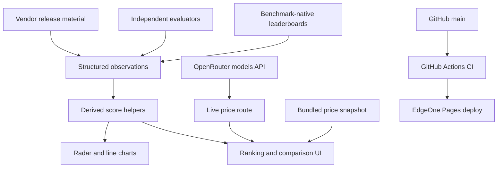
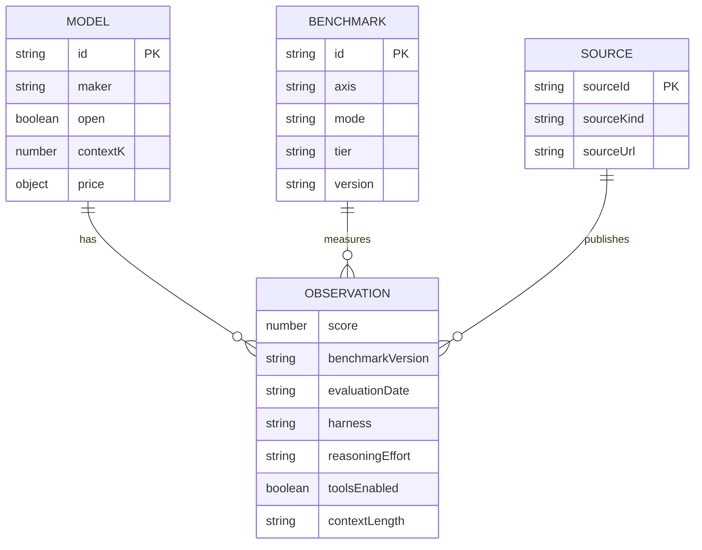
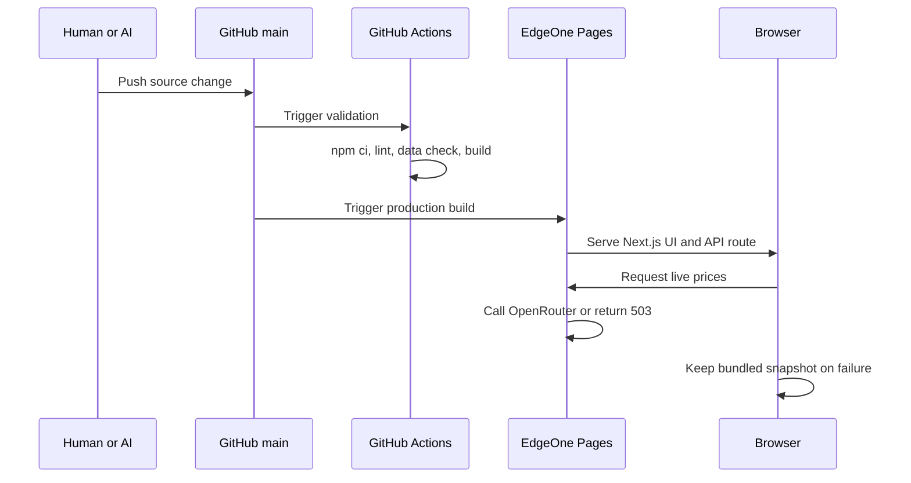

# AI Model Observatory Architecture

This document is the operational handoff for humans and coding agents. Read it before changing the data model, ranking semantics, deployment path, or UI structure.

## 1. System overview



The application has two data paths:

1. Versioned benchmark evidence bundled in `app/model-data.ts`.
2. Best-effort live price refresh through `app/api/live-models/route.ts`, with bundled prices retained when the upstream call fails.

## 2. Repository map

| Path | Responsibility |
| --- | --- |
| `app/model-data.ts` | Model metadata, benchmark taxonomy, observations, derived scores, source cards |
| `app/page.tsx` | Client state, rankings, coverage, radar, line charts, tables, language switching |
| `app/api/live-models/route.ts` | OpenRouter price/context lookup and short-lived cache |
| `app/globals.css` | Light visual system and responsive layout |
| `scripts/check-model-data.mjs` | Data integrity rules enforced in CI |
| `.github/workflows/ci.yml` | Lint, data contract, and production build checks |
| `README.md` | User-facing overview and deployment instructions |
| `AGENTS.md` | Short coding-agent operating contract |

## 3. Core entities



An observation is the atomic unit. Its conceptual key is:

```text
model × benchmark × benchmark_version × harness × reasoning_effort × tools_enabled × context_length
```

`BENCHMARK_SCORES` is derived from `BENCHMARK_OBSERVATIONS`. Do not create an independent score table or add a number without provenance.

## 4. Source policy

Use the strongest available source for each observation:

1. **Benchmark-native leaderboard** — preferred because its version and harness are controlled by the benchmark owner.
2. **Independent evaluator** — useful for cross-model consistency and professional-work evaluations.
3. **Vendor release material** — valid for filling gaps, but preserve its exact model configuration and harness notes.

The Kimi K3 release table is a useful comparison seed, not the benchmark standard. The same rule applies to every vendor table.

Do not merge values when any of these differ materially:

- DeepSWE v1.0 vs v1.1
- Terminal-Bench 2.0 vs 2.1
- HLE without tools vs with tools
- MRCR 128K average vs 1M pointwise
- Codex vs Claude Code vs Kimi Code vs Terminus vs mini-SWE-agent
- low/high/max reasoning effort

## 5. Capability and ranking semantics

Seven radar axes are defined in `AXES`. An axis is calculated only from available compatible core observations. Missing axes remain absent; they are not zero-filled.

Coverage means evidence completeness, not model quality:

| State | Meaning |
| --- | --- |
| `Not ingested` | No compatible core observation is loaded |
| `Partial` | Some compatible core observations are loaded |
| `Broad` | At least half of compatible core observations are loaded |

Ranking lenses stay separate:

- General capability: independent composite snapshot stored on the model record.
- Coding system: available core system-level coding observations.
- Agent system: available core system-level agent observations.
- Human preference: Arena Elo.
- Speed: output tokens per second.
- Value: current capability/cost heuristic.

These lenses answer different questions and must not be silently blended.

## 6. Runtime and deployment



Canonical production settings:

```text
Node.js: 22
Install: npm ci
Build: npm run build
Output: .next
Host: Tencent EdgeOne Pages
Source branch: GitHub main
```

GitHub Pages is intentionally not used because it is static-only and cannot run the current Next.js API route.

## 7. Change playbooks

### Add a model

1. Add one `ModelRecord` to `MODELS` with a stable slug-like ID.
2. Add provider lookup aliases to `app/api/live-models/route.ts` when live pricing exists.
3. Add only verified observations to `BENCHMARK_OBSERVATIONS`.
4. Let unavailable data remain absent; never create placeholder zeros.
5. Run the required checks and inspect the mobile ranking card and model detail.

### Add a benchmark

1. Add one `BenchmarkRecord` with axis, mode, tier, method, version, and canonical URL.
2. Decide whether it is `core`, `observe`, or `legacy` before adding scores.
3. Add version-specific observations with complete provenance.
4. Confirm line-chart normalization is appropriate; Elo currently uses a separate normalization path.
5. Update documentation if the capability taxonomy changes.

### Update an existing result

1. Never overwrite a value merely because a newer table has a different number.
2. Check whether version, harness, reasoning effort, tools, context length, model snapshot, or aggregation changed.
3. If the result is not comparable, model it as a distinct benchmark/version or update the schema before ingestion.
4. Record the new evaluation date and source URL.

## 8. CI contract

Every push and pull request must pass:

```bash
npm run lint
npm run check:data
npm run build
```

The data check currently enforces:

- unique model and benchmark IDs;
- no observations for unknown entities;
- finite numeric scores;
- source and version provenance;
- every derived score maps to an observation;
- minimum catalog/model size;
- retention of a known official Gemini 3.5 Flash observation as a regression guard.

## 9. Known limitations and next work

- Benchmark data is still manually transcribed; an ingestion pipeline and source-diff review would reduce drift.
- The UI stores only one observation per model/benchmark ID, so multiple harnesses or historical runs require a future observation-array schema.
- Live price matching is substring-based and should eventually use canonical provider model IDs.
- Pixel regression testing is not yet in CI. Add Playwright screenshots only after a stable public preview URL and baseline approval exist.
- General capability values are imported composite snapshots, not recomputed from the benchmark portfolio.
